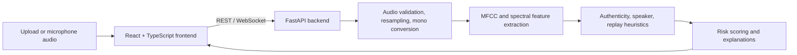

# VoiceGuard AI

AI-powered voice threat analysis prototype for detecting voice-cloning and replay indicators. Prepared for Smart India Hackathon (SIH) 2026.

> **Prototype status:** The current detectors are signal-processing heuristics and a baseline. They have not been validated on the benchmark datasets listed in the project documentation. Treat scores as demo guidance, not as a reliable identity or fraud verdict.

## Problem

Voice cloning can make scam calls sound like a family member, colleague, or authority figure. VoiceGuard AI explores how acoustic checks and transparent risk indicators can help a caller pause and verify suspicious requests through a trusted second channel.

## Features

- Analyze uploaded WAV, MP3, FLAC, M4A, OGG, WEBM, AAC, and OPUS audio.
- Inspect microphone audio through the live analysis interface.
- Capture microphone audio in short WAV chunks and submit them to the same audio API.
- Return audio metadata and measured spectral/pitch checks with explanations.
- Report authenticity, replay, speaker identity, and overall risk as unavailable until validated models are configured.
- Demonstrate threat scenarios, incident views, multilingual UI flows, and PDF reports.

Some screens use sample or hardcoded incident data. The current backend does not perform speech transcription or reliable language identification.

## Architecture



See [docs/architecture.md](docs/architecture.md) for the detailed design.

## Tech Stack

- **Frontend:** React 19, TypeScript, Vite, CSS, Lucide, jsPDF.
- **Backend:** Python, FastAPI, Uvicorn, NumPy, SciPy, SoundFile.
- **ML:** Signal feature extraction is implemented. No trained anti-spoof, replay, or speaker model is loaded by API inference.
- **Database:** None. Analysis history is held in process memory; incident records are sample data.

## AI Model and Evaluation

- **Current model status:** `MODEL_UNAVAILABLE`. API inference does not load a validated anti-spoof, replay, or speaker model. The `backend/models/weights.pkl` artifact was produced by the synthetic-data training fallback and is intentionally not used to classify uploaded audio.
- **Current analysis:** Audio decoding, resampling, metadata, and acoustic feature extraction are implemented. The API returns measured checks only; it does not claim a human/synthetic label, speaker match, replay verdict, or risk score.
- **Features:** The extractor computes 13 MFCCs, spectral centroid/bandwidth/roll-off, zero-crossing rate, RMS energy, pitch statistics, and high-frequency energy ratio. These measurements are not proof of synthetic or human speech.
- **Dataset:** No benchmark dataset is included or used for validated performance claims. `samples/` contains demonstration audio only. Prepare licensed datasets such as ASVspoof separately before training or evaluation.
- **Training:** `ml/train.py` accepts bonafide and spoof audio directories. Without both directories it generates synthetic feature vectors; those weights are not meaningful training and must not be used for detection.
- **Evaluation:** No valid evaluation results are available. `ml/evaluate.py --benchmark` is a synthetic metric-calculation demonstration, not model evaluation. Accuracy, precision, recall, F1, ROC-AUC, and EER are therefore not established.

## Results

No validated evaluation results are available yet. Do not interpret synthetic demo benchmark numbers as real-world detection performance.

| Metric | Result |
|---|---|
| Accuracy | Not established |
| Precision | Not established |
| Recall | Not established |
| F1 | Not established |
| ROC-AUC | Not measured |

## Demo

- **Live demo:** Not published.
- **Run locally:** Follow [Installation](#installation).
- **Sample audio:** See [`samples/`](samples/) and [`frontend/public/`](frontend/public/).

## Deployment

The combined Vercel project uses the repository root, installs the npm workspace, and builds Vite into `frontend/dist/`. The Python function in [`api/index.py`](api/index.py) exposes FastAPI using the root [`requirements.txt`](requirements.txt). The current production deployment routes `/api/*` to that function. Frontend API URLs are centralized; leave `VITE_API_URL` unset for same-origin Vercel deployment or set it to a separately deployed backend HTTPS origin. Check `/api/health` before testing microphone analysis. The health response distinguishes API availability from `model_loaded`; currently the API can be online while the classifier remains unavailable.

Live microphone analysis captures audio and sends WAV chunks to `/api/analyze-chunk`. It reports acoustic measurements, not an authenticity verdict, until validated model weights and evaluation are supplied.

The backend allows `https://voiceguard-ai-psn1.vercel.app`, localhost development origins, and optional explicit origins through `CORS_ORIGINS`. For local development, the Vite proxy forwards API and WebSocket requests to `localhost:8000`.

## Screenshots

No screenshots are included yet. Add images under a `docs/screenshots/` directory and link them here when available.

## Installation

Requirements: Python 3.10+ and Node.js/npm. Run the backend and frontend in separate terminals from the repository root.

### Backend (PowerShell)

```powershell
py -m venv .venv
.\.venv\Scripts\Activate.ps1
python -m pip install -r backend/requirements.txt
python -m uvicorn backend.app:app --reload --port 8000
```

The API documentation is available at `http://localhost:8000/docs`.

### Frontend

```powershell
cd frontend
npm install
npm run dev
```

Open the Vite URL shown in the terminal (by default, `http://localhost:5173`). The Vite development server proxies `/api` and `/ws` to `localhost:8000`. For a separately hosted backend, configure `VITE_API_URL` and, when needed, `VITE_WS_URL` using [`frontend/.env.example`](frontend/.env.example).

## API

| Method | Path | Purpose |
|---|---|---|
| `GET` | `/api/health` | Backend/module status |
| `POST` | `/api/analyze` | Analyze an uploaded audio file; optional `reference_file` and `language` fields |
| `POST` | `/api/analyze-chunk` | Analyze one live WAV chunk through the same inference pipeline |
| `POST` | `/api/verify-speaker` | Compare reference and incoming audio |
| `POST` | `/api/detect-replay` | Return replay heuristic indicators |
| `GET` | `/api/history` | Read current process's in-memory analysis history |
| `GET` | `/api/v1/call-shield/incidents` | Read sample incident records |
| `POST` | `/api/v1/call-shield/analyze-threat` | Assess a threat category, optionally with audio |
| WebSocket | `/ws/live-detection` | Receive live audio chunks and return heuristic telemetry |

## Limitations

- The authenticity, replay, speaker, and combined risk classifiers are unavailable; no trained model is loaded.
- No benchmark performance results, calibration study, or ROC-AUC measurement is available.
- The standalone trained classifier is not used by the API detector.
- Transcript and language-confidence response fields are placeholders; incident content is sample data.
- History is in-memory, disappears on restart, and is not shared across server workers.
- Speech transcription, language identification, contextual scam detection, and live telephony integrations are not implemented.
- Call Shield incident cards are explicitly fictional simulation records, not observed incidents.
- This prototype should not be the sole basis for identity verification, financial decisions, emergency response, or law-enforcement action. Verify sensitive requests using an independently trusted channel.

## License

No repository license is specified yet. Check licenses and usage terms for any external datasets or assets before redistributing them.
