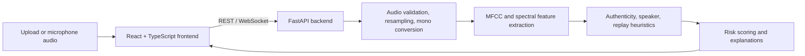

# VoiceGuard AI

AI-powered voice threat analysis prototype for detecting voice-cloning and replay indicators. Prepared for Smart India Hackathon (SIH) 2026.

> **Prototype status:** The current detectors are signal-processing heuristics and a baseline. They have not been validated on the benchmark datasets listed in the project documentation. Treat scores as demo guidance, not as a reliable identity or fraud verdict.

## Problem

Voice cloning can make scam calls sound like a family member, colleague, or authority figure. VoiceGuard AI explores how acoustic checks and transparent risk indicators can help a caller pause and verify suspicious requests through a trusted second channel.

## Features

- Analyze uploaded WAV, MP3, FLAC, M4A, OGG, WEBM, AAC, and OPUS audio.
- Inspect microphone audio through the live analysis interface.
- Produce heuristic authenticity, speaker-similarity, replay, and combined risk scores.
- Show acoustic indicators and suggested response steps.
- Demonstrate threat scenarios, incident views, multilingual UI flows, and PDF reports.

Some screens use sample or hardcoded incident data. The current backend does not perform speech transcription or reliable language identification.

## Architecture



See [docs/architecture.md](docs/architecture.md) for the detailed design.

## Tech Stack

- **Frontend:** React 19, TypeScript, Vite, CSS, Lucide, jsPDF.
- **Backend:** Python, FastAPI, Uvicorn, NumPy, SciPy, SoundFile.
- **ML:** Handcrafted acoustic heuristics in the API; a separate NumPy logistic-regression baseline training script.
- **Database:** None. Analysis history is held in process memory; incident records are sample data.

## AI Model

- **Model:** Baseline acoustic rules for synthetic-voice and replay indicators; MFCC/spectral-vector cosine similarity for speaker comparison. The standalone logistic-regression training pipeline is not wired into API inference.
- **Dataset:** No benchmark dataset is included or used for validated performance claims. `samples/` contains small demonstration audio files. The ML documentation describes external benchmarks such as ASVspoof; obtain and prepare those separately according to their terms.
- **Features:** 13 MFCCs, spectral centroid/bandwidth/roll-off, zero-crossing rate, RMS energy, pitch statistics, and high-frequency energy ratio.
- **Training:** `ml/train.py` accepts bonafide and spoof audio directories. With no dataset directories, it generates synthetic feature vectors; that mode is only a pipeline demonstration, not meaningful model training.
- **Evaluation:** `ml/evaluate.py --benchmark` runs a synthetic metric-calculation demo. It does not measure generalization to real speech. No verified ROC-AUC or benchmark results are currently available.

## Results

No validated evaluation results are available yet. Do not interpret synthetic demo benchmark numbers as real-world detection performance.

| Metric | Result |
|---|---|
| Accuracy | Not established |
| Precision | Not established |
| Recall | Not established |
| F1 | Not established |
| ROC-AUC | Not measured |

## Demo

- **Live demo:** Not published.
- **Run locally:** Follow [Installation](#installation).
- **Sample audio:** See [`samples/`](samples/) and [`frontend/public/`](frontend/public/).

## Deployment

## Deployment

The combined Vercel project uses the repository root as its project root:
- **Serverless API Function**: [`api/index.py`](api/index.py) exports the FastAPI `app` as a Vercel Serverless Function. [`vercel.json`](vercel.json) rewrites `/api/*` requests directly to this function.
- **Frontend Build**: [`build.py`](build.py) compiles the Vite React frontend into Vercel's static `public/` directory during deployment.
- **Dependencies**: Root [`requirements.txt`](requirements.txt) installs the FastAPI and acoustic processing packages into Vercel's Python runtime.
- **Client-Side Routing**: Single Page Application (SPA) routes are rewritten to `/index.html` while preserving direct static asset delivery.
- **Verification**: Once deployed, visit `https://<your-deployment>/api/health` to confirm the backend is healthy (`"status": "healthy", "ai_engine_online": true`). The live microphone and audio analysis will immediately connect without requiring `VITE_API_URL`. If using a separately hosted backend (e.g. Render or Railway for continuous WebSockets), configure `VITE_API_URL` and `VITE_WS_URL`.

The backend also allows all Vercel project deployment origins by default and supports explicit origins through `CORS_ORIGINS`. For local development, the Vite proxy forwards API and WebSocket requests to `localhost:8000`.

## Screenshots

No screenshots are included yet. Add images under a `docs/screenshots/` directory and link them here when available.

## Installation

Requirements: Python 3.10+ and Node.js/npm. Run the backend and frontend in separate terminals from the repository root.

### Backend (PowerShell)

```powershell
py -m venv .venv
.\.venv\Scripts\Activate.ps1
python -m pip install -r backend/requirements.txt
python -m uvicorn backend.app:app --reload --port 8000
```

The API documentation is available at `http://localhost:8000/docs`.

### Frontend

```powershell
cd frontend
npm install
npm run dev
```

Open the Vite URL shown in the terminal (by default, `http://localhost:5173`). The Vite development server proxies `/api` and `/ws` to `localhost:8000`. For a separately hosted backend, configure `VITE_API_URL` and, when needed, `VITE_WS_URL` using [`frontend/.env.example`](frontend/.env.example).

## API

| Method | Path | Purpose |
|---|---|---|
| `GET` | `/api/health` | Backend/module status |
| `POST` | `/api/analyze` | Analyze an uploaded audio file; optional `reference_file` and `language` fields |
| `POST` | `/api/verify-speaker` | Compare reference and incoming audio |
| `POST` | `/api/detect-replay` | Return replay heuristic indicators |
| `GET` | `/api/history` | Read current process's in-memory analysis history |
| `GET` | `/api/v1/call-shield/incidents` | Read sample incident records |
| `POST` | `/api/v1/call-shield/analyze-threat` | Assess a threat category, optionally with audio |
| WebSocket | `/ws/live-detection` | Receive live audio chunks and return heuristic telemetry |

## Limitations

- Detectors are heuristic baselines, not validated production anti-spoofing or biometric models.
- No benchmark performance results, calibration study, or ROC-AUC measurement is available.
- The standalone trained classifier is not used by the API detector.
- Transcript and language-confidence response fields are placeholders; incident content is sample data.
- History is in-memory, disappears on restart, and is not shared across server workers.
- The live WebSocket path currently decodes incoming PCM bytes differently from the frontend's signed 16-bit PCM stream; live WebSocket scores may be unreliable.
- This prototype should not be the sole basis for identity verification, financial decisions, emergency response, or law-enforcement action. Verify sensitive requests using an independently trusted channel.

## License

No repository license is specified yet. Check licenses and usage terms for any external datasets or assets before redistributing them.
